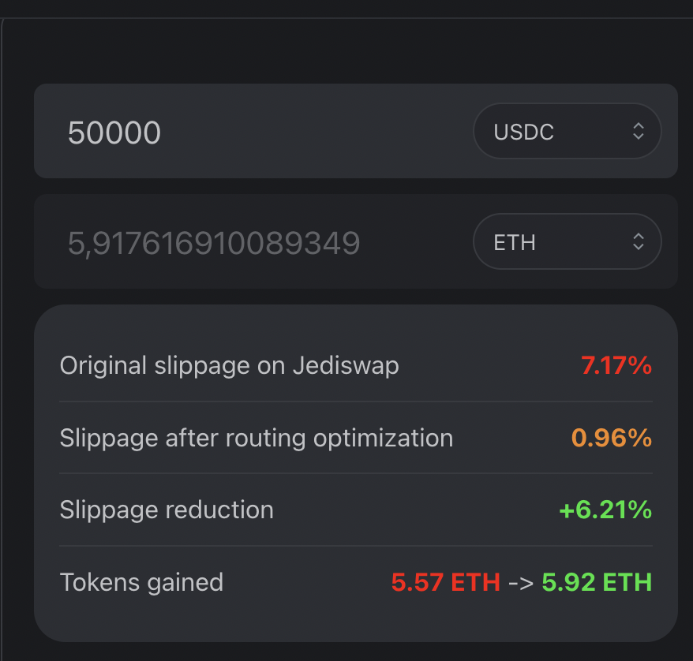

# Sphinx Pathfinder

### Packages

- `simulations`: scripts folder for calcuating routes.

- `ui`: example frontend showcasing how routing works and the impact it has in the total cost for a swap. Metrics considered: 
  - **Original slippage on Jediswap**: Original slippage without applying routing.
  - **Slippage after routing optimization**: Slippage appliying routing.
  - **Slippage reduction**: Difference between original price impact and price impact applying routing. 
  - **Additional tokens gained**: The result difference when using routing optimization.

<div style='float: center'>
  </img>
</div>

---

In addition it shows a graph representing the routing proportion between the AMM and Orderbook.

<div style='float: center'>
  </img>
</div>

### Build

To build all apps and packages, run the following command:

```
cd pathfinder
yarn run build
```

### Develop

To run ui

```
cd pathfinder/packages/ui
yarn dev
```

To run simulation

```
cd pathfinder/packages/simulations
yarn ts-node simulate-testnet.ts
```